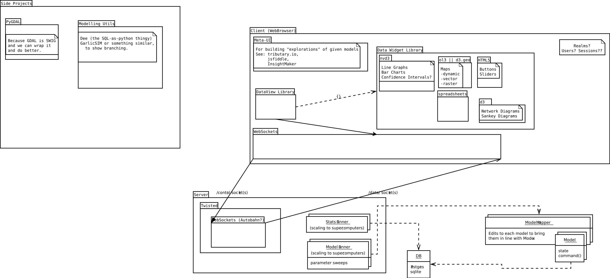

Architecture Overview and Goal
================================

We have a sort of hyper-[MVC](https://en.wikipedia.org/wiki/Model-view-controller)
 problem: our "model" is the union of 
(the current state(s) of running (scientific, eg SLUCE, NetLogo, Eutopia) models,
the raw output from those models, the aggregation (see below) of the output into statistics); our "view" is actually many views: the many open web browsers pointed at the same model page, or perhaps you can think of it as all the subcomponents (eg the graphs that user 1 has made view one slice of data, the map user 2 has open views another slice); and that leaves our "controller"-- which we've been calling "Model Explorer" for lack of a better name-- to be a broker between these components.

Model exploring deals in two classes of things which are unfortunately both called models:
 - models being run and collected -- these are our simulations, e.g. agent-based models, spatially-explicit models, random die-roll models
 - models to hypothesise about the relationships in the former kind of model  -- these are things like "if we assume gaussian errors, bank accounts $ ~ B0 + B1*gdp + B2*carbon_footprint"

Components we need:
===================
Model Runner:
 - something that can run a model (in a separate process) and ~log states it goes through~
 - something that knows what seed parameters the model has 
 
 - should be generic enough to handle all sorts of models:
   - time-stepped simulations
     - agent-based
  ^ is there any hope of making it so we can arbitrary models? or do we demand that the model either
    a) take our logging object at init (Inversion of Control)
    b) output in a very constrained fashion (either to SQL or JSON with particular limited db schemas, and/or stdout)
     -> there's a strong argument for forcing data to SQL; it requires some effort 
     -> but can SQL handle changing GIS data? (TODO: learn PostGIS; it has wisdom for us)
     (the logged variates need space for comments, which we will display on the frontend, so that the user doesn't need to dig up some painfully dense academic pdf just to find out what ```y_u7``` is)  
 - Repast(?) (http://repast.sourceforge.net/docs/api/repastjava/repast/simphony/data/logging/package-summary.html) ActiveRecord, ccmsuite
 
 (what about going back in time? is that impossible?)
 (there's a very big difference between )


Model API(s)
 - provides common things like time series, rasters
 - inspiration: Repast, PyABM, ABCE, NetLogo

View objects
 - the only true goal in exploring scientific models is finding the relationships between variables (There's some detours you need to take because of noise, probability, confidence levels, and confounding (aka hidden) variables). A key point, then, is that it needs to be as easy for someone using the frontend to say "plot the distribution of age versus quality" as it is for someone--in say R or SciPy--to say ```plot(quality, age, data=wine)``` or ```hist(quality)```.
- a _view_ is a selection, a subset of data you are interested in. [all SQL implementations have this built in](http://www.sql-tutorial.com/sql-views-sql-tutorial/), we just need to expose something similar to the frontend. The data in the view can change, but _what_ the view is showing does not. For example, a view might be defined as "bank account values of all agents with age over 35" or "all vector GIS data for the extent [[a,b][c,d]] (where the rectangle [[a,b], [c,d]] covers Alberta)" or "raster of variances of water density"; as the knowledge the server has changes (either by the simulation
 
Networking
 - frontend needs to be able to send commands to the backend (ie RPC)
 - 

State.js (http://activerecordjs.org/ sounds very very close to what I have in mind)
 - we need a way to keep the frontend in sync with the backend, 
   on "whatever" (to be defined) data objects it cares to watch
    * this has all sorts of useful effects:
      - as more aggregation data comes in and our confidence intervals shrink, that can be displayed automagically
      - as the model runs--IF the model runs (some models won't be interactive themselves -- e.g. the SLUCE model -- and the 'interaction' a user has with it is choosing what columns to make scatterplots and histograms over)--we can update its state and display that
    * State.js should also allow feedback: the front end needs to be able to edit the data objects (but the server is under no obligation to listen necessarily)

(do we need some way to warn the enduser if they are about to download a large dataset?)
(at the very least, we need metrics to catch that, so that model developers
 


Widgets we need:
 - a map viewer AND editor
 - time series viewer
 - scatterplots
 - histograms
^ some (but not all!) of these should be overlayable; that is, if it makae sense (they share an axis or something), the histograms should be able to plop onto the scatterplots. Easy overlaying is going to be a big feature, as far as the scientists are concerned. can we overlay onto the map?
^ the widgets should understand State.js: we must not need to explicitly do updates, all that should be internal to the widgets; when we get to polishing, they should do nice transitions (when called for??) and harsh ones (when not: if you reset the model to 6 steps back) 
^ all of these can be done in d3, except the map viewer will probably be nicer in OpenLayers (but we should build out bo)
  raster tiles in d3: http://bl.ocks.org/mbostock/4132797
  old thread on d3 vs openlayers vs the competition: https://groups.google.com/forum/#!topic/d3-js/4CQ7tmpDi-E
    -> gotcha with GeoJSON https://groups.google.com/forum/#!topicsearchin/d3-js/openlayers|sort:date|spell:true/d3-js/eaZvrWq9pu0
   ...do we need openlayers? what does it give us?
  

Aggregation (Statistical) Tools we need:
 - sums
 - confidence intervals (by bootstrapping?)
   - and estimates of the stability, because we want to discover and work around unstable regions we 
 - density estimates (both by histograms and by kernel)
 ^ all of these should be invokable from the frontend; which is tricky, because they are heavy-lifting and should probably be computed on the backend
 ^ another way to look at this is that aggregations should _cache_  eg. on sluce.wici.ca, the "visuaization" is mostly just plain SQL table dumps and the visual part is a raster, plotted using R, and cached to sluce.wici.ca/data/2011_07_27/graphs/ (and they need to defined in a declarative, so
 that we can write careful framework code which knows when it can use the cache and when the cache is dirty).
 
We see a few of these components in [Dawn et. al's LMM](http://sluce.wici.ca/visualization/results/?marketLevel=%2BResource+Constraints&worldSize=&neighborhoodSize=&unitTransportCost=&worldXCenter=&worldYCenter=&numBuyer=&numSeller=&maxBiddingTries=&agResPrice=100&numSearchParcel=4000&maxBidNums=1&utilityBeta=&sdUtilBeta=&rangeUtilBeta=&meanBudget=&sdBudget=&randomSeed=&runIndex=0)
 --> data is at http://sluce.wici.ca/data/
also, 
we need to ask Terry Stewart about how they handle recording data from models that are interactive,
like their Dalek example wherein the Dalek has some neurons for eyes and its motors and will wander around by itself,
**but also can be picked up and dropped on things**.

The [core of the 2004 SLUCE model](http://vserver1.cscs.lsa.umich.edu/sluce/models/ARMSR-Swarmfest04.tar.gz)/src/ARMSR/Model.java lines 1104 - 1184, for comparison
```
	public void step() {
		
		// See if there are any farms for sale
		sellFarms();

		// develop farms into subdivisions
		developFarms();
		
		// sell lots within subdivisions
		sellLots();

		// have some residents move out
		moveOut();

		// checks to make sure the distributtion is okay
		checkDistribution();

	}

	// stepReport
	// each step write out:
	//   time  avgUnhappiness  avgSize
	// Note: put a header line in via the startReportFile (below in this file)
	public void stepReport () {
		// set up a string with the values to write
		String s = Format.sprintf( "%5.0d", p.add( getTickCount() ) );

		// go through each township
		for (int i=0; i<townshipList.size(); i++) {

			// get the current township
			Township t = (Township)townshipList.get(i);

			// calculate the income
			s += Format.sprintf("  %6.0d  ", 
								p.add( t.calculateIncome() ) );

			// calculate the avg forest
			s += Format.sprintf("  %6.3f  ", 
								p.add( t.calculateAvgForest() ) );

			// count the number of country subs
			s += Format.sprintf("  %6.0d  ", 
								p.add( t.countSubs( (int) Subdivision.COUNTRY) ) );

			// count the number of horticultural subs
			s += Format.sprintf("  %6.0d  ", 
								p.add( t.countSubs( (int) Subdivision.HORT) ) );
			// count the number of remnant subs
			s += Format.sprintf("  %6.0d  ", 
								p.add( t.countSubs( (int) Subdivision.REMNANT) ) );
		}

		// write it to the xml and plain text report files
		writeLineToReportFile ( "<stepreport>" + s + "</stepreport>" );
		writeLineToPlaintextReportFile( s );

		getReportFile().flush();
		getPlaintextReportFile().flush();
	}
```


^ note that this architecture diagram is out of date slightly.

## Model
????????

The model is probably not parallelizable. Subparts of it may be--and depending on what the model is written in some parts might nicely parallelize and others might be impossibly serial
* [Modelling](Modelling.md)

We need to distinguish in our mind and our code stochastic (randomized) models from nonstochastic models (nonstochastic models can still show complex and/or chaotic behaviour!!)

## Frontend

  The frontend should appear to be an attractive video game, but one where graphs and data can be brought up at a moments' notice. We're ambitiously attempting to gamify science.

The frontend does:
* render layered maps (_[openlayers](http://ol3js.org/)_)
  * allow the user to choose what layers they are looking at (to some degree; we don't want to overwhelm)
  * allows interaction with the map. OpenLayers provides [widgets](http://ol3js.org/en/master/apidoc/ol.control.html) and "[interactions](http://ol3js.org/en/master/apidoc/ol.interaction.html)" which we can extend and patch upstream as needed
* allow comparison of 'any' (upper bounded by cognitive load) user-chosen set of variables (_[D3](http://d3js.org)_)
  * this means plots, with a way to mouseover something and export numbers
  * 1d and 2d distributions with confidence indicated
  * If we can work out a way to sensibly show 4d data, that would be cool
* render flow diagrams for aiding causation tracking
* at a low enough zoom level, renders agents from one of the simulations running in the backend
* also the frontend must be responsive, on the order of 10ms (**todo: tcstewart's citation**) 

See also [Visualizations](Visualizations.md) for in-depth details about the rainbow of ways to render data at our beck and call.

The frontend should be graphics and network-bound; it should not be doing any numerical computations itself.


## Backend

 Probably Python/Scipy
 GDAL (for geographic data)
 [http://repast.sourceforge.net/](Repast)?
 If it is useful, build the db on Postgres with the PostGIS extension

### Rough API idea for querying the model
```
farmmodel[7].products["wheat"]  #at time-step 7, what is the amount of production of 'wheat'
```


   current plan is to build an app in python using [Twisted](http://twistedmatrix.com/trac/) which hosts [GarlicSIM](GarlicSIM.md) models, and handles recording data

 The backend is a Twisted server hosting some static content and a bunch of dynamic endpoints. ((should we go for a RESTful situation or try to use Autobahn?)). Layout is:

* ```index.html```  -- the main action occurs on this stage
* ```/css```
* ```/js```
* ```/assets```
  * ```/assets/images``` -- sprites, art
  * ```/assets/maps```   -- GIS datasets ((do we really want to expose these literally here?))
  * ```/assets/data```   -- more typical tabular data
  * ```/assets/libs```   -- external frontend dependencies, like d3 and ol3
* ```/maps```
  * ```/maps/raster```
    * index is a json listing of available rasters
    * ```/maps/raster/<rastername>/z/x/y.png``` -- a (potentially dynamically drawn) bitmap of the map at tile coordinates (x,y,z) on layer ```rastername```. some of these rasters are typical mappy maps, most are fields like rainfall amounts or pollutant concentration or albedo
  * ```/maps/vector```
    * index is a json listing of available vectors
    * each vector might actually be dynamic!
    * OSM and d3 handle treating vectors as tiled blocks: see [Vector Tiles](http://bl.ocks.org/mbostock/5616813) at the d3 examples, and look at http://b.tile.openstreetmap.us/vectiles-highroad/13/1309/3167.json for an example of the format given.
* ```/data/indicators```  -- websockets giving streams of data for plotting
  * ```/data/indicators/carbon/```
  * ```/data/indicators/happiness```
* ```/control``` 

((in all this we haven't talked at all about sessioning: how do we let users choose to either collab or to start their own simulation instance))

### Model Explorer
  A major component for us is a tool at some remove from the nitty details of the rest of the system for exploring models in general. This wiki is in the "modex" repository right now, reflecting the importance of this tool. It might also be called the Simulation Host, which in an [IoC](http://en.wikipedia.org/wiki/Inversion_of_control) way, loads and collects results from simulation runs. It should be able to easily record, slice and visualize any aspect of the simulation. The closest work we have in mind is tcstewar's [ccmsuite](https://github.com/tcstewar/ccmsuite) and (the unmaintained) [GarlicSim](https://github.com/cool-RR/GarlicSim) (in fact we might just take up maintenance GarlicSim). Also, for the sake of getting other research groups interesting, using, and eating our own dogfood, the simulation host should be as platform agnostic as possible.

Model Explorer's duties are:
 * load models
 * batch run lots of copies of a model
   * clearly distinguish and provide hooks for handling deterministic models sampled at different initial conditions, nondeterministic models sampled several times at the same initial conditions, and mixtures
 * provide a consistent data API (similar to how Repast collects several timestepping and geographic APIs in one place) ([Architecture#wiki-rough-api-idea-for-querying-the-model](Architecture.md)?)
   * to be clear: **modex must record the entire history of the state machine**
   * and this log must be as close to efficiently queryable along any dimension as possible ((TODO: find a reference on why it is impossible to totally normalize a database along every dimension))
 * generate plots
 * generate statistics, all using the bootstrap method so we can get accurate (ie nonparametric) values
  * estimates
  * probability densities
  * condidence intervals
  * **And** plots of these where relevant (eg estimated temperature on a map, estimated sensitivity field across a state space plot)

It seems like [GarlicSIM](GarlicSIM.md) does much of this already, but it's unmaintained. We need to investigate it.

The backend should be designed to be CPU-bound, not disk, network, or memory-bound. So, it should exploit parallelization as much as it can and liberally cache states.

**Aspects** is a key word here, as even a simple five-object model has 5 objects each of which could have some arbitrary number of variables of interest (weight, tempurature, wealth, happiness, ...) and 5-choose-2=10 pairs which means that any relationship of interest has 10 series that need tracking, and all of this is potentially recorded over time. We need to have a tight way to record this information, and a tighter way to reduce it to useful slices.
   ([ccmsuite](http://github.com/tcstewar/ccmsuite), or whatever develops to replace it)

### Importing (csv, shapefile, graphviz)
  [Datasets](Datasets.md)

### Exporting (csv, graphs)


 
