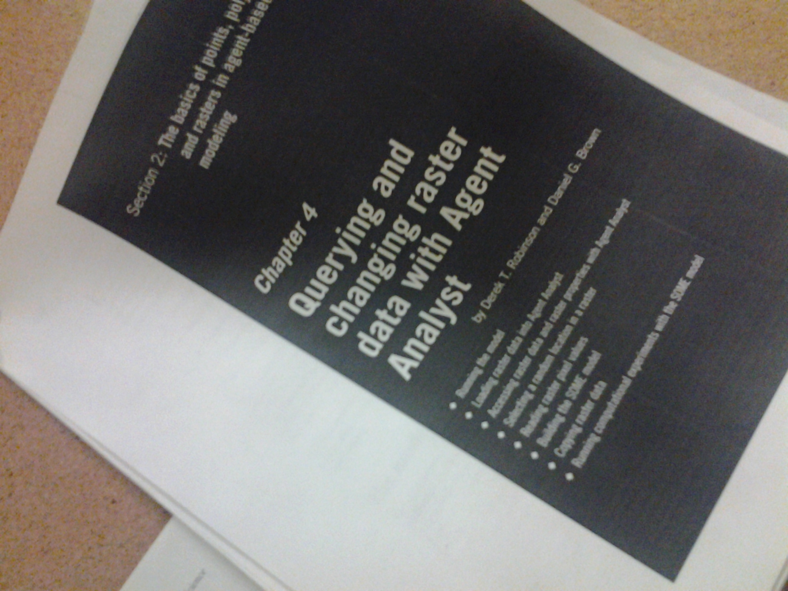

# Academic References

_(Tip: use search.crossref.org to find [DOI](http://www.doi.org/)s for refere ces and automatically cite them into MLA format)_

## Complexity

Anderson, P. W. “More Is Different.” Science 177.4047 (1972): 393–396. [doi:science.177.4047.393](http://dx.doi.org/10.1126/science.177.4047.393)

Bak, Per, Chao Tang, and Kurt Wiesenfeld. “Self-Organized Criticality: An Explanation of the 1/f Noise.” Physical Review Letters 59.4 (1987): 381–384. [doi](http://dx.doi.org/10.1103/physrevlett.59.381)

## Modeling

[Multiphysics simulation](http://en.wikipedia.org/wiki/Multiphysics)

### GIS
http://corridordesign.org/

Harvard has [http://www.gsd.harvard.edu/gis/manual/raster/index.htm](a tutorial) on GIS operations which gives solid intuitive crash course in rasters, vectors, what they mean and what you can do with them (make sure to mouse-over the highlighted words!). (It's got lots of typos and could be condensed, so we should recreate something similar for our own website -nick).

This guy is kewl: http://fromgistors.blogspot.ca/search/label/Tutorial

### Agent

## Visualization

Brosz, John et al. [http://dx.doi.org/10.1145/2501988.2502046](“Transmogrification.”) Proceedings of the 26th annual ACM symposium on User interface software and technology - UIST  13. Association for Computing Machinery, 2013. 97-106. ((also available direct [http://innovis.cpsc.ucalgary.ca/Publications/_Brosz:2013:TCM](here)).

Borland, David, and Russell Taylor Ii. “Rainbow Color Map (Still) Considered Harmful.” IEEE Computer Graphics and Applications 27.2 (2007): 14-17.

### Symbology
Klippel, Alexander et al. [http://dx.doi.org/10.3138/carto.44.3.217](“Colour-Enhanced Star Plot Glyphs: Can Salient Shape Characteristics Be Overcome?”) Cartographica: The International Journal for Geographic Information and Geovisualization 44.3 (2009): 217-231.

Harter, Jonathan M. et al. [http://dx.doi.org/10.1117/12.907486](“Increasing the perceptual salience of relationships in parallel coordinate plots.”) Visualization and Data Analysis 2012. Ed. Pak Chung Wong et al. SPIE - International Society for Optical Engineering, 2012. 82940T.

### Cartography
[http://www.radicalcartography.net/?projectionref](Cartographic Projections), with lots of pictures

### Network Maps
Alice Thudt, Dominikus Baur and Sheelagh Carpendale. [http://innovis.cpsc.ucalgary.ca/Publications/_Thudt:2013:Visits](Visits: A Spatiotemporal Visualization of Location Histories.) EuroVis 2013. _a clever rearrangement of timeseries-map data; we could use this to show the flow of goods_

[https://en.wikipedia.org/wiki/Sankey_diagram](Sankey Diagrams) _which display weighted, directed networks by size of the edges (e.g. the [OpenSecrets Lobbying Pulse Chart](http://www.opensecrets.org/outsidespending/nonprof_growth.php) or the famous [Minard plot of Napoleon's march on Russian](https://en.wikipedia.org/wiki/File:Minard.png). Available to us in d3.js and matplotlib and R._. For more inspiration, check out [http://www.sankey-diagrams.com/](this blog).

# Gaming References and Inspiration

* Simutrans / OpenTTD
* SimCity (all editions)
* Civ4 and Civ5 (nb: Civ5 is scriptable in Lua, and [InfoAddict](http://forums.civfanatics.com/showthread.php?t=391069) makes the charts and graphs we need)

# Software References
Here's some software which has aspects of the data-modelling-visualization ideas we are looking at

* http://map.geo.admin.ch/ ([source code](https://github.com/geoadmin/mf-geoadmin3))
  * they also have some interesting [gamification of their own](https://github.com/geoadmin/mf-swissguesser) built on Ol3.

* http://sunlightfoundation.com/tools/
* http://data.influenceexplorer.com/
* http://www.opensecrets.org/
  * --> 
* http://www.muckety.com/
  **(this list is messy. please fix it -nick)**
* http://www.openabm.org/
* http://ccl.northwestern.edu/netlogo/
* http://repast.sourceforge.net/
* http://insightmaker.com/

# Essays
http://www.wired.com/business/2014/01/quants-dont-know-everything/
 -- on the ignored self-referential effect of systemetization and "objective" measures on the systems they are measuring

# The Competition

These are sites which combine at least some of data archiving, visualization, and/or analysis:

* [Bombe](http://www.getbombe.com/)
* [Aniconist](https://www.aniconist.com/wiki/index.php/AniconistWiki:About)
* OCUL's [ODESI](http://odesi.ca/) (behind a paywall)
* [Canadian Government Open Data](http://data.gc.ca/) (_collects data collections from many different government agencies which may or may not have already been open_)
* [US Government Open Data](http://data.gov)
* [Scholar's Geoportal](http://geo1.scholarsportal.info/) (behind a paywall)